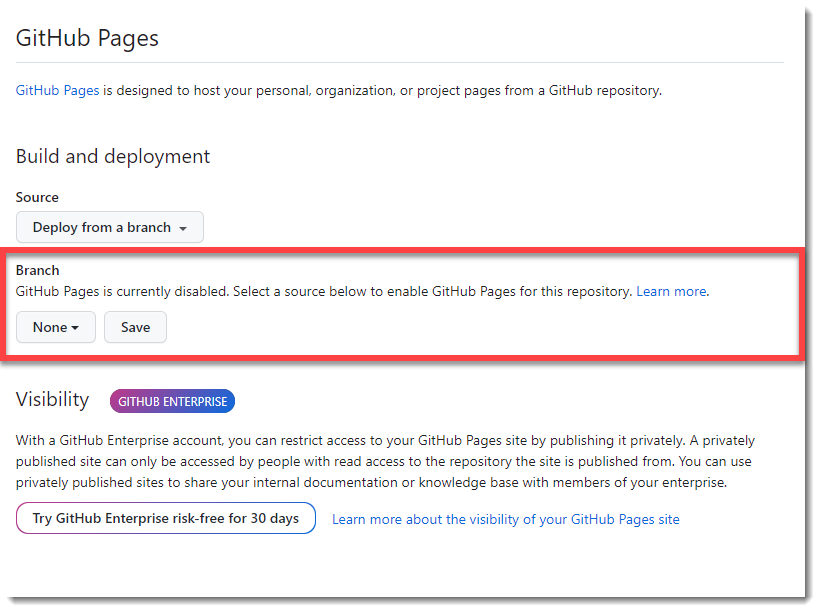
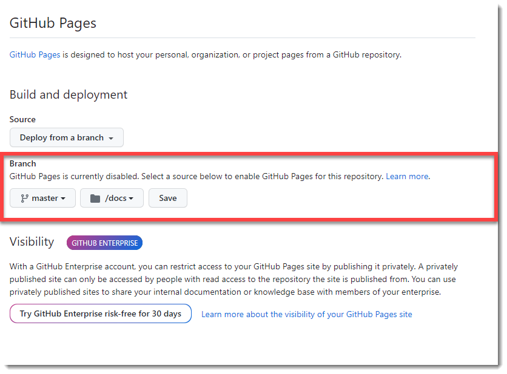
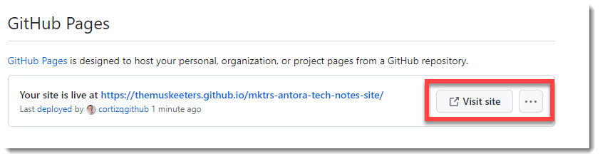

:toc: macro
:toclevels: 5
:toc-placement!:
= mktrs-antora-tech-notes-site README

V2025.1.0

toc::[]

= Introduction
Publishes the Antora `tech-notes` docs over Github Pages.
This content is found in https://github.com/TheMuskeeters/mktrs-antora-tech-notes[The Musketeers Tech Notes Repository,window=_blank]

AS you can see, there is a folder named *docs* which actually contains the site
contents. They are a simple copy of the *Antora* generated buld, but this Github
repository uses the *Github Pages* to serve the static pages.

In order to server files you must go to the repository *_Settings_* and have it set up as follows.

Locate in the left page the link _*Pages*_, as *Github Pages* is not enabled by default, it will show as

.Github Pages Config Home

Then you must select the branch and folder where the content is published. 

.Github Pages Config Home Branch Selection

After you have selected the requested data, click the _*Save*_ button to enable the deployment of content to *Github Pages* host.

You receive a confirmation of the action as shown next.

.Github Pages Config Confirmation

[NOTE]
====
You can use the following URL to access the site.

* https://themuskeeters.github.io/mktrs-antora-tech-notes-site/[The Musketeers Tech Notes Site (github Pages),window=_blank]

And if you want to learn about *AsciiDoctor* use this link.

* link:https://asciidoctor.org[AsciiDoctor,window=_blank]
====
